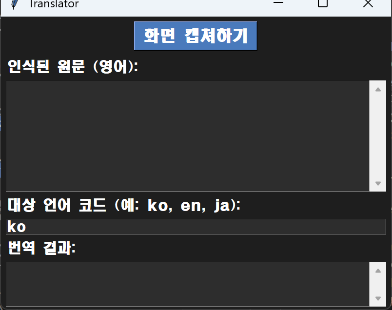

# OCR_translater
## 1. 개요
11주차 과제로 제출한 기획안을 바탕으로 제작하였음.  
구글의 Circle To Search에서 착안한 화면 캡쳐 번역기를 구현하는 것이 목표.  
본 문서는 프로젝트의 코드를 설명할 목적으로 작성됨.

<br>

**주요 기능**
-   화면 영역 선택 및 캡쳐
-	이미지에서 텍스트 추출 (OCR)
-	추출된 텍스트 자동 번역
-   클립보드에 번역 결과 복사   
<br>
  
## 2. 기초 설명
### 시스템 환경
- **하드웨어 요구사항**
    -	운영체제: Windows 10/11  

- **소프트웨어 요구사항**
    -	Python 3.8 이상 
    -	Tesseract OCR
    -	인터넷 연결 (번역 API 사용 위함)

### 제약 조건
-	인터넷 연결이 필요함 (Google 번역 API 사용)
-	Tesseract OCR 엔진이 사전 설치되어 있어야 함
-	OCR 정확도는 이미지 품질에 의존함

### 사용 라이브러리
|라이브러리|버전|용도|
|---|---|---|
|tkinter|기본(내장)|GUI 구현|
|requests|2.31|번역 사이트 접근|
|pyperclip|1.8+|클립보드 복사|
|Pytesseract|0.3.10+|이미지에서 텍스트 추출|
|Pillow(PIL)|10.0+|이미지 처리|
|ctypes|기본(내장)|해상도 문제 처리|
<br>

## 3. 코드 동작 흐름

### 1. 프로그램 실행 
```
if __name__ == "__main__":
    app = TranslatorApp()
    app.run()
```
```
class TranslatorApp:
    def __init__(self):
        self.root = tk.Tk()
        self.root.title("Translator")
        self.root.geometry("800x600")
        self.root.configure(bg="#1e1e1e")
        
        self.setup_ui()
...
```
1. `TranslatorApp()` 객체 생성  
2. `__init__()` 실행  
3. `setup_ui()` 메인 GUI 구성  
4. `root.mainloop()` 이벤트 대기  
<br>

### 2. 메인 GUI 생성 (TranslatorApp 클래스)
```
class TranslatorApp:
    def __init__():
        ...(위와 동일)
        
    def setup_ui(self):
        캡처 버튼
        원문 텍스트 영역
        대상 언어 코드 영역
        번역 결과 영역
        클립보드 버튼
        ...
```
**▼ 메인 창 구성** 

  
<br>

### 3. 화면 캡쳐
```
class TranslatorApp:
    ...
    def setup_ui():
        ...
        command=self.start_capture
```
1. 버튼 클릭 시 `start_capture()` 실행  
```
class TranslatorApp:
    ...
    def start_capture(self):
            self.root.withdraw()
            self.root.after(200, self._do_capture) 

    def _do_capture(self):
        ScreenCaptureOverlay(self.on_capture_complete)
```
2. `self.root.withdraw()` 메인 창 숨김(캡쳐를 원하지 않는 부분)  
3. `self.root.after(200, self._do_capture)` 창을 채 닫기도 전에 캡쳐되면 상당히 곤란함. 200ms 딜레이로 **선행 작업들을 
기다림**.  
4. `ScreenCaptureOverlay(self.on_capture_complete)` **ScreenCaptureOverlay 객체 생성**함. 이 객체를 생성함과 동시에 캡쳐&&선택영역 오버레이 생성이 자동으로 발생
5. **마우스 영역 선택** (마우스를 누른 위치(start)와 마우스를 뗀 위치(end)를 기록해서 그 두 점으로 사각형 영역을 만듦)
6. 이미지 잘라내기 && **callback 호출**  
<br>

### 4. callback (on_capture_complete)
```
class TranslatorApp:
    ...
    def on_capture_complete(self, image):
        ...
```

1. 메인 GUI 다시 표시
2. 이미지에서 텍스트 인식
3. 원문 텍스트 영역에 표시
4. 자동 번역 실행   
<br>

### 5. OCR 처리(텍스트 인식)
```
class TranslatorApp:
    ...
    def on_capture_complete(self, image):
        ...
        if image:
            try:
                extracted_text = extract_text_from_image(image)
```
```
def extract_text_from_image(image):
    text = pytesseract.image_to_string(image, lang='eng')
    return text.strip()
```
테서렉트가 이미지 분석, 영어 텍스트 추출  
<br>

### 6. 번역 수행
이하 직전 프로젝트와 거의 동일함.  
<br>

## 구조 간소화
>**mainloop()**  
>>버튼 (캡쳐) 클릭  
  마우스 드래그   
  콜백 실행 (이벤트 처리 함수들) 

이 `mainloop()`의 반복으로 요약할 수 있다.

